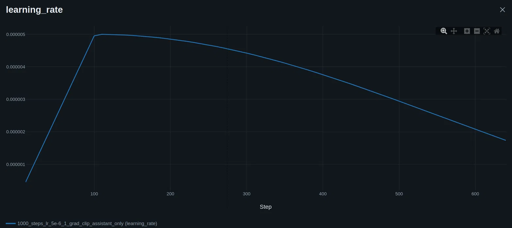
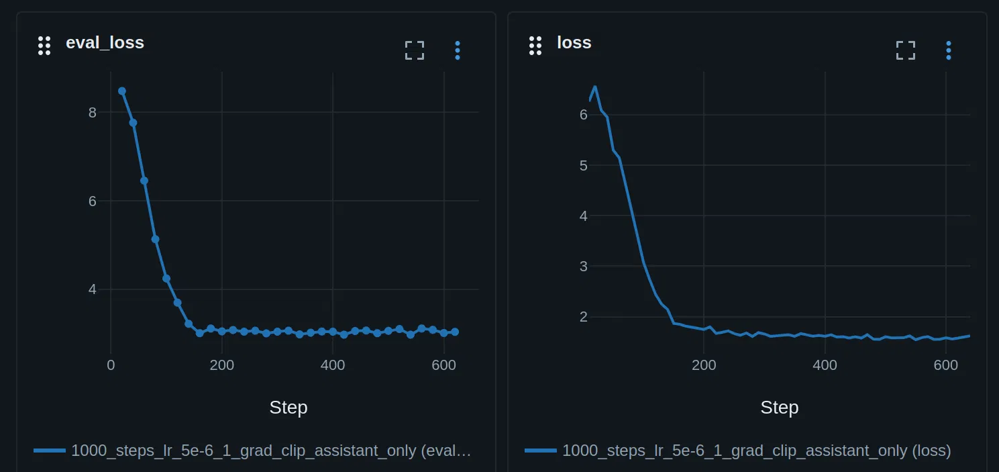

# SFT Training Report

## Setup

- Input packing enabled to improve training throughput and allow full-epoch training
- `assistant_only_loss` applied to mask user prompt tokens from loss computation
- Chat template updated to reflect the masking approach

## Training Observations

### Loss Behavior

- Both train and eval loss decreased rapidly in the first 100–200 steps (~800 steps/epoch)
- Loss plateaued after this initial phase and remained flat for the remainder of training
- This stagnation persisted regardless of the following adjustments:
  - Learning rate range: 1e-6 to 5e-5
  - Shorter and longer warmup durations
  - Different schedulers (cosine, linear)
  - Varying max gradient norm values

The charts below show a representative run with 100 warmup steps and a cosine scheduler, illustrating this typical pattern:

### Gradient Norm

- Gradient norm was consistently high: values between 5 and 15
- Disabling gradient clipping (default max norm = 1) and testing alternative clip values did not change the trend

### Downstream Evaluation (LLM Harness)

Evaluated on IFEval, MMLU, and GSM8K — all benchmarks showed significant performance degradation compared to the base model.

## Summary

The loss curve suggests the model quickly adapts to the new data format but stops making meaningful progress after ~150–200 steps. The benchmark degradation is consistent with catastrophic forgetting, likely exacerbated by the gradient clipping experiments. Grad norm values of 5–15 are not unusual for small models and may not be the root cause.

## Possible Next Steps

- Tune learning rate more carefully and train for more epochs
- Add HellaSwag to the evaluation suite